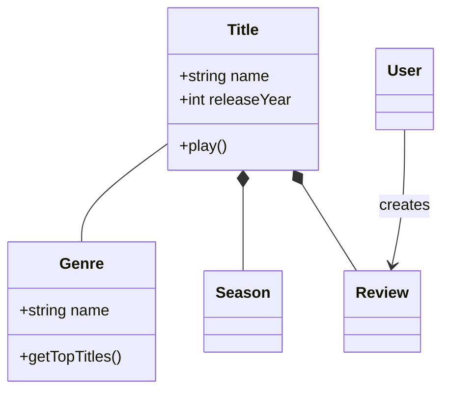
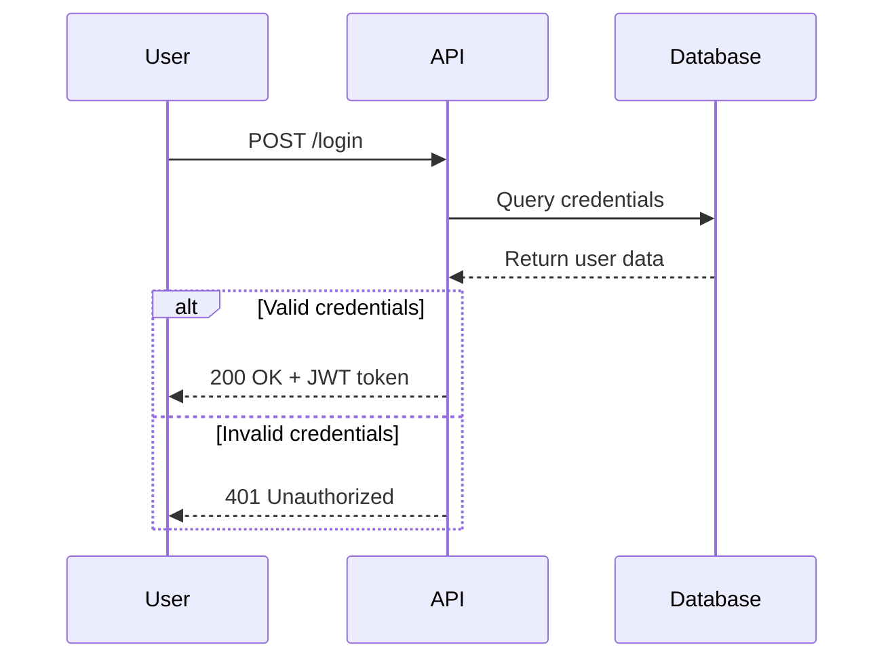
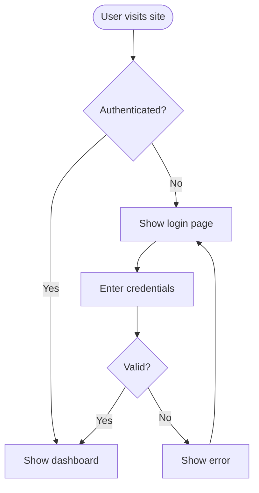
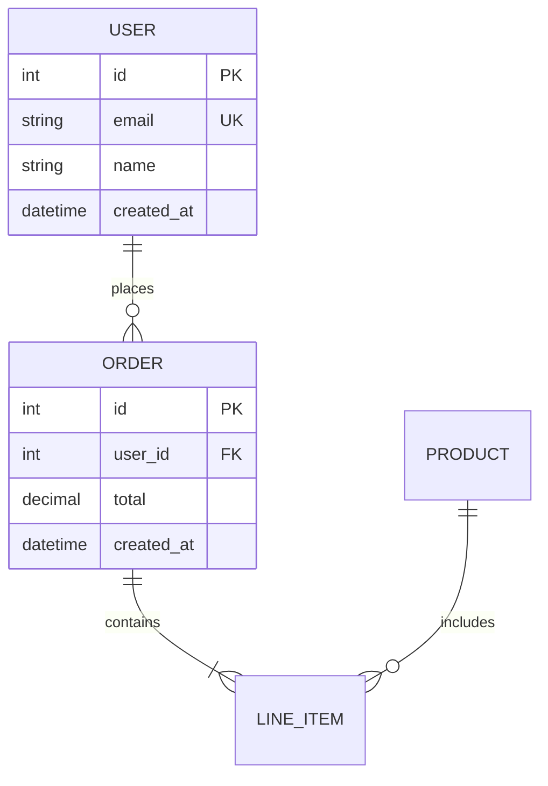
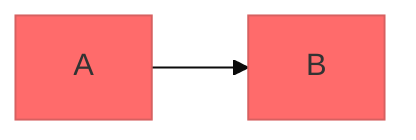

# Mermaid Diagramming

Create professional software diagrams using Mermaid's text-based syntax. Mermaid renders diagrams from simple text definitions, making diagrams version-controllable, easy to update, and maintainable alongside code.

## Core Syntax Structure

All Mermaid diagrams follow this pattern:

```mermaid
diagramType
  definition content
```

**Key principles:**
- First line declares diagram type (e.g., `classDiagram`, `sequenceDiagram`, `flowchart`)
- Use `%%` for comments
- Line breaks and indentation improve readability but aren't required
- Unknown words break diagrams; parameters fail silently

## Diagram Type Selection Guide

**Choose the right diagram type:**

1. **Class Diagrams** - Domain modeling, OOP design, entity relationships
   - Domain-driven design documentation
   - Object-oriented class structures
   - Entity relationships and dependencies

2. **Sequence Diagrams** - Temporal interactions, message flows
   - API request/response flows
   - User authentication flows
   - System component interactions
   - Method call sequences

3. **Flowcharts** - Processes, algorithms, decision trees
   - User journeys and workflows
   - Business processes
   - Algorithm logic
   - Deployment pipelines

4. **Entity Relationship Diagrams (ERD)** - Database schemas
   - Table relationships
   - Data modeling
   - Schema design

5. **C4 Diagrams** - Software architecture at multiple levels
   - System Context (systems and users)
   - Container (applications, databases, services)
   - Component (internal structure)
   - Code (class/interface level)

6. **State Diagrams** - State machines, lifecycle states
7. **Git Graphs** - Version control branching strategies
8. **Gantt Charts** - Project timelines, scheduling
9. **Pie/Bar Charts** - Data visualization

## Quick Start Examples

### Class Diagram (Domain Model)


### Sequence Diagram (API Flow)


### Flowchart (User Journey)


### ERD (Database Schema)


## Detailed References

For in-depth guidance on specific diagram types, see:

- **[references/class-diagrams.md](references/class-diagrams.md)** - Domain modeling, relationships (association, composition, aggregation, inheritance), multiplicity, methods/properties
- **[references/sequence-diagrams.md](references/sequence-diagrams.md)** - Actors, participants, messages (sync/async), activations, loops, alt/opt/par blocks, notes
- **[references/flowcharts.md](references/flowcharts.md)** - Node shapes, connections, decision logic, subgraphs, styling
- **[references/erd-diagrams.md](references/erd-diagrams.md)** - Entities, relationships, cardinality, keys, attributes
- **[references/c4-diagrams.md](references/c4-diagrams.md)** - System context, container, component diagrams, boundaries
- **[references/architecture-diagrams.md](references/architecture-diagrams.md)** - Cloud services, infrastructure, CI/CD deployments
- **[references/advanced-features.md](references/advanced-features.md)** - Themes, styling, configuration, layout options

## Best Practices

1. **Start Simple** - Begin with core entities/components, add details incrementally
2. **Use Meaningful Names** - Clear labels make diagrams self-documenting
3. **Comment Extensively** - Use `%%` comments to explain complex relationships
4. **Keep Focused** - One diagram per concept; split large diagrams into multiple focused views
5. **Version Control** - Store `.mmd` files alongside code for easy updates
6. **Add Context** - Include titles and notes to explain diagram purpose
7. **Iterate** - Refine diagrams as understanding evolves

## Configuration and Theming

Configure diagrams using frontmatter:



**Available themes:** default, forest, dark, neutral, base

**Layout options:**
- `layout: dagre` (default) - Classic balanced layout
- `layout: elk` - Advanced layout for complex diagrams (requires integration)

**Look options:**
- `look: classic` - Traditional Mermaid style
- `look: handDrawn` - Sketch-like appearance

## Exporting and Rendering

**Native support in:**
- GitHub/GitLab - Automatically renders in Markdown
- Zed, Notion, Obsidian, Confluence - Built-in support
- VS Code - With Markdown Mermaid extension

**Export options:**
- **[merman-cli](https://github.com/Latias94/merman) (recommended)** - Headless Rust binary; no Node, Chrome, or Puppeteer. `brew install merman-cli`, then:
  ```
  merman-cli render input.mmd --out output.svg
  merman-cli render --format png --out output.png input.mmd
  merman-cli render --format ascii input.mmd      # terminal preview
  merman-cli parse input.mmd --pretty             # syntax check / semantic JSON
  ```
  Targets `mermaid@11.15.0`; coverage and gaps tracked in [`docs/alignment/STATUS.md`](https://github.com/Latias94/merman/blob/main/docs/alignment/STATUS.md).
- Mermaid CLI - `npm install -g @mermaid-js/mermaid-cli` then `mmdc -i input.mmd -o output.png`
- [Mermaid Live Editor](https://mermaid.live) - Online editor with PNG/SVG export
- Docker - `docker run --rm -v $(pwd):/data minlag/mermaid-cli -i /data/input.mmd -o /data/output.png`

## Validating Diagrams

Before declaring a diagram done, run the local validator:

```
scripts/validate_mermaid.py path/to/diagram.mmd
scripts/validate_mermaid.py path/to/document.md   # extracts ```mermaid fences
cat diagram.mmd | scripts/validate_mermaid.py -
```

For each block, the script parses it via `merman-cli` and renders a small ASCII preview. The ASCII output is the *semantic* check: parsing only confirms syntax — eyeballing the rendered shape catches typos and wrong-direction arrows that parse fine but don't mean what was intended. Long renders (>60 lines) spill to a tempfile and the script prints a pointer.

Requires `merman-cli` on PATH (see Export options above for install).

For a flowchart of the script's own control flow, see `scripts/validate_mermaid.mmd`.

## Common Pitfalls

- **Breaking characters** - Avoid `{}` in comments, use proper escape sequences for special characters
- **Syntax errors** - Misspellings break diagrams. Validate locally with `scripts/validate_mermaid.py` (see above), or use [Mermaid Live](https://mermaid.live) in the browser.
- **Overcomplexity** - Split complex diagrams into multiple focused views
- **Missing relationships** - Document all important connections between entities

## When to Create Diagrams

**Always diagram when:**
- Starting new projects or features
- Documenting complex systems
- Explaining architecture decisions
- Designing database schemas
- Planning refactoring efforts
- Onboarding new team members

**Use diagrams to:**
- Align stakeholders on technical decisions
- Document domain models collaboratively
- Visualize data flows and system interactions
- Plan before coding
- Create living documentation that evolves with code

## Attribution

Adapted from the `mermaid-diagrams` skill in [softaworks/agent-toolkit](https://github.com/softaworks/agent-toolkit) (MIT). This version's own additions are the author's work, granted under the skill's [LICENSE](./LICENSE). Full notice: [ATTRIBUTION.md](./ATTRIBUTION.md).
